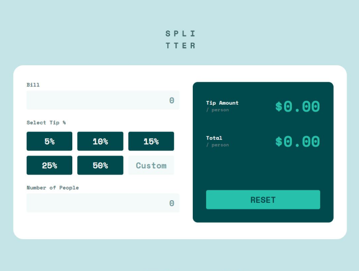

# Frontend Mentor - Tip calculator app solution

This is a solution to the [Tip calculator app challenge on Frontend Mentor](https://www.frontendmentor.io/challenges/tip-calculator-app-ugJNGbJUX). Frontend Mentor challenges help you improve your coding skills by building realistic projects.

## Table of contents

- [Overview](#overview)
  - [The challenge](#the-challenge)
  - [Screenshot](#screenshot)
  - [Links](#links)
- [Style Guide](#style-guide)
  - [Layout](#layout)
  - [Colors](#colors)
    - [Primary](#primary)
    - [Neutral](#neutral)
- [My process](#my-process)
  - [Built with](#built-with)
- [Author](#author)

## Overview

### The challenge

Users should be able to:

- View the optimal layout for the app depending on their device's screen size
- See hover states for all interactive elements on the page
- Calculate the correct tip and total cost of the bill per person

### Screenshot

### Links

- Live Site URL: [Tip Calculator App](https://gabrielojorge.github.io/Tip-caculator-app/)

## Style Guide

### Layout

The designs were created to the following widths:

- Mobile: 375px
- Desktop: 1440px

### Colors

#### Primary

- Strong cyan: hsl(172, 67%, 45%)

#### Neutral

- Very dark cyan: hsl(183, 100%, 15%)
- Dark grayish cyan: hsl(186, 14%, 43%)
- Dark grayish cyan: hsl(184, 14%, 56%)
- Light grayish cyan: hsl(185, 41%, 84%)
- Light grayish cyan: hsl(189, 41%, 97%)
- White: hsl(0, 0%, 100%)

### Typography

### Body

- Family: [Space Mono](https://fonts.google.com/specimen/Space+Mono)
- Weights: 400, 500, 700

## My Process

### Built with

- HTML5
- CSS
- JavaScript
- Flexbox
- Mobile-first workflow

## Author

- Website - [Gabriel O. Jorge](https://gabrielojorge.github.io/Portifolio/)